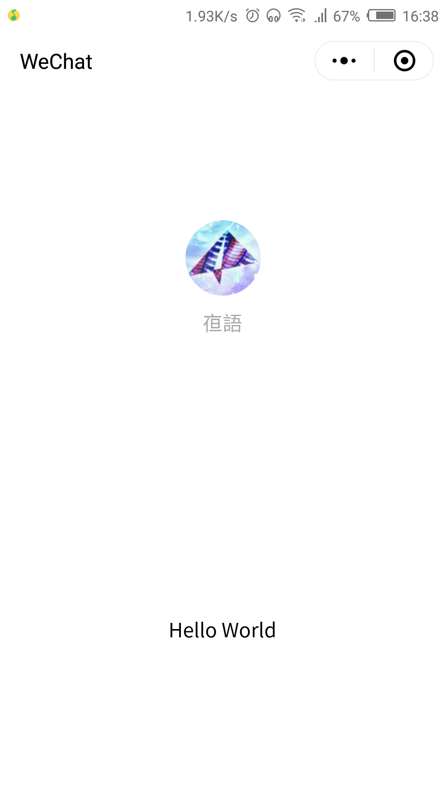

# 小程序 数据代理

### 微信开发工具导入项目

```console
  新建项目 -> 导入src文件 -> 预览效果
```

### 代码

> proxy.js

```js
  const nativePage = Page
  const nativeComponent = Component
  Page = (options, key = 'onLoad') => {
    const native = options[key]
    options[key] = function () {
      this.ctx = proxy.call(this)
      return native && native.call(this)
    }
    key === 'onLoad' ? nativePage(options) : nativeComponent(options)
  }
  Component = options => Page(options, 'created')

  function proxy() {
    let pending = false
    const setData = () => {
      pending = true
      setTimeout(() => {
        this.setData(this.data, () => pending = false)
      })
    }

    const handler = {
      get(target, key, receiver) {
        try {
          if (typeof target[key] === 'function') return Reflect.get(target, key, receiver)
          return new Proxy(target[key], handler)
        } catch (err) {
          return Reflect.get(target, key, receiver)
        }
      },
      set(target, key, value, receiver) {
        if (!(Array.isArray(target) && key !== 'length')) !pending && setData()
        return Reflect.set(target, key, value, receiver)
      },
      deleteProperty(target, key) {
        !pending && setData()
        return Reflect.deleteProperty(target, key)
      }
    }
    return new Proxy(this.data, handler)
  }
```

### 使用

> 在 app.js 中引入 proxy.js 文件

```js
  require('./vendor/proxy.js')
```

> 在 index 页面中的 index.js 中使用 

```js
  onLoad: function () {
    this.ctx.motto = 'Hello Echo'
    this.ctx.user.name = 'Echo'
  }
```

> 在 movable 组件中的 movable.js 中使用

```js
  created: function () {
    this.ctx.visible = true
  }
```

### 截图预览

> 数据更新前 和 更新后 对比

<div align=center>
  
  
</div>

### 原理说明

* 拦截数据变化，调用 this.setData 方法
* 多条数据变化，合并一次更新
* 代理对象绑定到 this.ctx 上下文中，同步更新 this.data 数据

### 如果觉得不错，请动动您的小拇指，star一下
